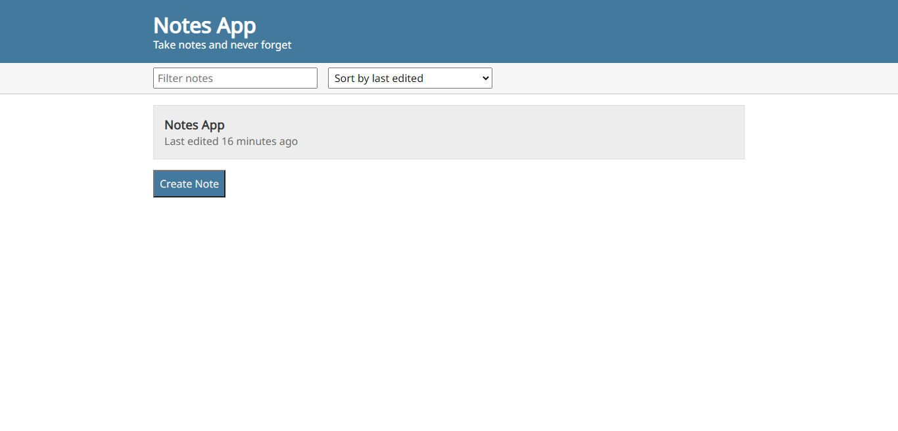

# Notes App 

This is a simple notes app that stores your notes with local storage for the best possible performance. It also includes options for sorting your notes by the different options listed, as well as a search field to find the note you need when you need it.

## Table of Contents

- [Overview](#overview)
    - [The challenge](#the-challenge)
    - [Screenshot](#screenshot)
    - [Links](#links)
- [My process](#my-process)
    - [Built with](#built-with)
- [Author](#author)
- [Acknowledgement](#acknowledgement)

## Overview

### The challenge
Users should be able to:

- Perform CRUD operations
- Search for notes
- Reorder notes by dragging
- Sort notes by various options 

### Screenshot

### Links

- Solution URL: [Source Code](https://github.com/blarrklad/notes-app)
- Live Site URL: [Live Preview](https://notes-app-alpha.vercel.app)

## My process

### Built with

- Semantic HTML5 markup
- CSS custom properties
- Flexbox

## Author
- Instagram - [@blarrklad](https://instagram.com/blarrklad)
- Twitter - [@blarrklad](https://twitter.com/blarrklad)

## Acknowledgement
This project is a clone from [+100 JavaScript Projects](https://js-beginners.github.io/notes-app/index.html)